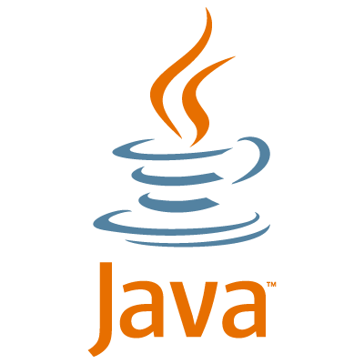
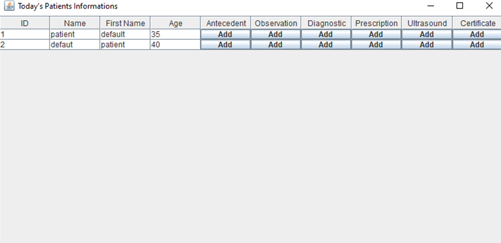
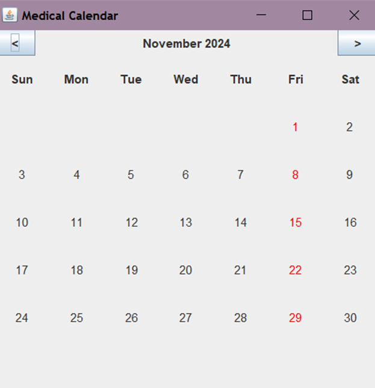
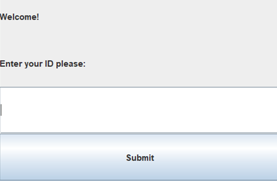
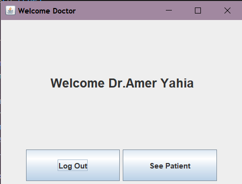

# Medical Office Managment (MOM)
## An application developped in Java based on Object Oriented Programming (OOP) concepts.
### 1. Overview
The Medical Office Management System is designed to assist in managing a gynecology office named “Bloom Care” in this example. It includes this following features : 
* Organization of patients files.
* Efficient scheduling of appointments.
* Recording of observations and prescriptions written by doctors.
* Management of access to information via an intuitive interface.

This project, available on the master branch, aims to minimize time and reduce effort spent on administrative tasks while improving data management.

---
### 2. Main features
#### a). Patient Managment 
* Add a new patient (first name, last name, date of birth, and phone number) to a file after logging in as a nurse.
* For medical record management, after each consultation, an automatic update is performed to save patient data, such as observations and prescriptions written by the doctor.
#### b). Scheduling Appointments
* The nurse is responsible for scheduling an appointment between a patient and the doctor of their choice, based on the doctor's availability calendar.
* Automatic check of appointment availability.
* After adding each appointment an automatic update is made for the calendar.
* A notification via SMS is sent to each patient 24 hours before their appointment.
* By default each consultation lasts 1 hour.
#### c). Doctors Managment
* A personalized calendar for each doctor, taking into account the days and hours the doctor is present at the medical office.
* We assumed that in our medical office we have two specialties therefore two doctors.
#### d). Security 
* A login code verifies the identity of the user to ensure that they are authorized to access the system.
* Once logged in, the system identifies the role associated with the user (doctor or nurse) and grants them the appropriate permissions.

---
### 3. Technologies Used 
#### a). Language
* **Java** : Java serves as the primary language for developing the application's core logic

  

#### b). Programmation Oriented Object (OOP)
* Classes : 'Patient', 'Doctor', 'Doctor1Calendar', 'Doctor2Calendar', 'Person,' 'Nurse'....
* **Inheritance** : 'Doctor' and 'Nurse' Inherite from Person...
* **Encapsulation** : Use of getters and setters to control data access.
* **Polymorphism**: e.g : The 'Patient' class overrides the 'toString' method from the 'Person' class
* Composition: The 'Doctor' class has a field of type 'ArrayList<Patient>', meaning it is composed of Patient objects. 
* Constructors

#### c). User Interface (UI)
* Swing for a simple and functional grahical interface.
* **preview** :
  * patients and their information saved :
 
  

   * Implementation of calendar logic:

    

  * log int / out :

    
    

#### d). Database
* File to store data on patients and appointments.

---
### 4. Installation
* Clone the folder "MedicalOfficeManagment" to your local environment.
* Import the project into your IDE (use VS code it's better).
* Run the code to start the application.

---
### 5. Contributors
* Hamdi Sarah  https://github.com/hamdisarah
* Amer Yahia Mellissa  https://github.com/mmellyo 

